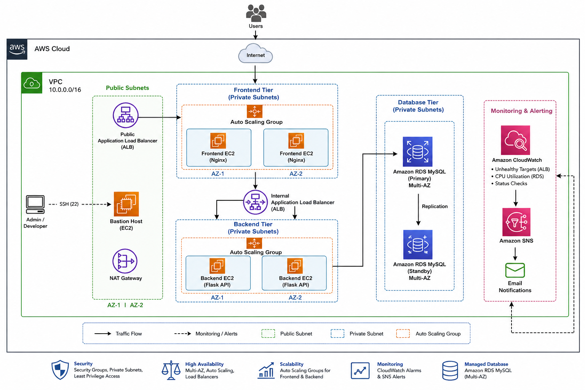
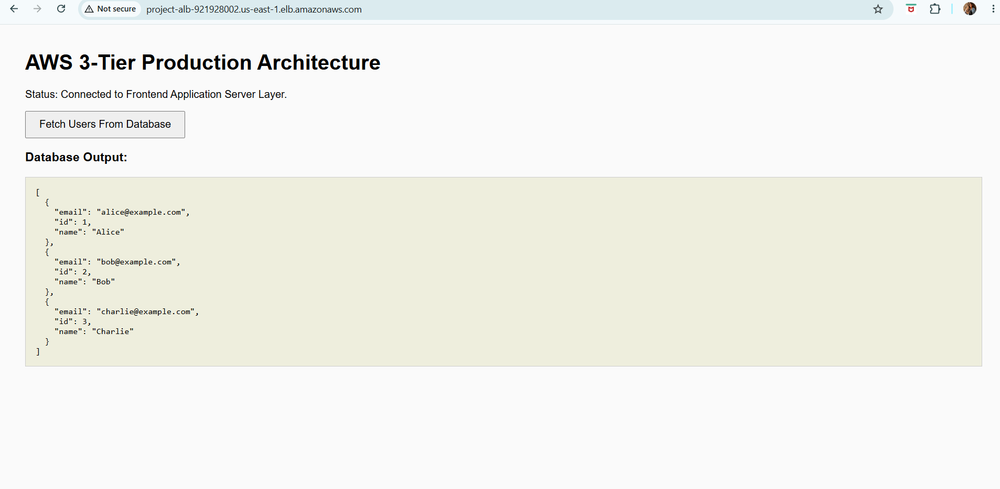

# AWS 3-Tier Architecture using Terraform

## Project Overview

This project demonstrates the deployment of a highly available AWS 3-Tier Architecture using Terraform.

The infrastructure consists of:

* Bastion Host
* Public Application Load Balancer (ALB)
* Frontend Auto Scaling Group
* Internal Application Load Balancer (ALB)
* Backend Auto Scaling Group
* Amazon RDS MySQL (Multi-AZ)
* CloudWatch Monitoring
* SNS Email Notifications

The architecture follows a production-style design with public and private subnets, load balancing, auto scaling, database security, and monitoring.

---

## Architecture Diagram



---

## Architecture Flow

```text
Internet
    │
    ▼
Public ALB
    │
    ▼
Frontend Auto Scaling Group
    │
    ▼
Internal ALB
    │
    ▼
Backend Auto Scaling Group
    │
    ▼
Amazon RDS MySQL
```

---

## AWS Services Used

* Amazon VPC
* Public & Private Subnets
* Internet Gateway
* NAT Gateway
* EC2 Launch Templates
* Auto Scaling Groups
* Application Load Balancers
* Amazon RDS MySQL
* Security Groups
* CloudWatch
* Amazon SNS
* Terraform

---

## Network Design

### Public Subnets

* Bastion Host
* Public Application Load Balancer
* NAT Gateway

### Frontend Private Subnets

* Frontend EC2 Instances

### Backend Private Subnets

* Backend EC2 Instances
* Amazon RDS MySQL

---

## Security Design

### Bastion Security Group

* SSH (22) from administrator workstation

### Public ALB Security Group

* HTTP (80) from Internet

### Frontend Security Group

* HTTP (80) from Public ALB
* SSH (22) from Bastion Host

### Internal ALB Security Group

* HTTP (80) from Frontend Instances

### Backend Security Group

* HTTP (80) from Internal ALB
* SSH (22) from Bastion Host

### RDS Security Group

* MySQL (3306) from Backend Instances only

---

## Application Workflow

1. User accesses the Public ALB.
2. Public ALB forwards traffic to Frontend EC2 instances.
3. Frontend tier communicates with the Internal ALB.
4. Internal ALB forwards requests to Backend EC2 instances.
5. Backend Flask application retrieves data from Amazon RDS MySQL.
6. Results are returned to the Frontend UI.

---

## Application Screenshot



---

## Database Initialization (Required)

Before using the application, initialize the MySQL database manually from the Bastion Host.

### Step 1: Connect to Bastion Host

```bash
ssh -i your-key.pem ec2-user@<bastion-public-ip>
```

### Step 2: Install MySQL Client

```bash
sudo dnf install -y mysql
```

### Step 3: Connect to Amazon RDS

```bash
mysql -h <rds-endpoint> -u admin -p
```

### Step 4: Create Database

```sql
CREATE DATABASE projectdb;
USE projectdb;
```

### Step 5: Create Users Table

```sql
CREATE TABLE users (
    id INT AUTO_INCREMENT PRIMARY KEY,
    name VARCHAR(100),
    email VARCHAR(100)
);
```

### Step 6: Insert Sample Records

```sql
INSERT INTO users (name, email)
VALUES
('Alice', 'alice@example.com'),
('Bob', 'bob@example.com');
```

---

## Monitoring & Alerting

CloudWatch alarms are configured for:

### Frontend Tier

* Unhealthy Target Count

### Backend Tier

* Unhealthy Target Count

### Amazon RDS

* CPU Utilization above 70%

### Notifications

Amazon SNS sends email alerts whenever alarms are triggered.

---

## Deployment Steps

### Initialize Terraform

```bash
terraform init
```

### Validate Configuration

```bash
terraform validate
```

### Review Execution Plan

```bash
terraform plan
```

### Deploy Infrastructure

```bash
terraform apply
```

### Destroy Infrastructure

```bash
terraform destroy
```

---

## Terraform Outputs

After deployment Terraform provides:

* Bastion Public IP
* Public ALB DNS Name
* Internal ALB DNS Name
* RDS Endpoint

---

## Project Structure

```text
Terraform-three-tier-project/

├── provider.tf
├── variables.tf
├── vpc.tf
├── security-groups.tf
├── alb.tf
├── launch-templates.tf
├── autoscaling.tf
├── bastion.tf
├── rds.tf
├── monitoring.tf
├── outputs.tf

├── userdata/
│   ├── frontend.sh.tpl
│   └── backend.sh.tpl

└── images/
    ├── architecture-diagram.png
    └── frontend-ui.png
```

---

## Learning Outcomes

This project demonstrates:

* Infrastructure as Code (Terraform)
* AWS VPC Design
* Public and Private Subnets
* Application Load Balancers
* Auto Scaling Groups
* Launch Templates
* Amazon RDS MySQL
* Security Group Design
* CloudWatch Monitoring
* SNS Alerting
* High Availability Architecture

---

## Resume Highlights

* Designed and deployed a highly available AWS 3-tier architecture using Terraform.
* Implemented public and internal Application Load Balancers.
* Configured Auto Scaling Groups and Launch Templates for frontend and backend tiers.
* Developed a Flask-based backend integrated with Amazon RDS MySQL.
* Implemented CloudWatch monitoring and SNS-based alerting.
* Secured infrastructure using layered Security Groups and private subnet architecture.
